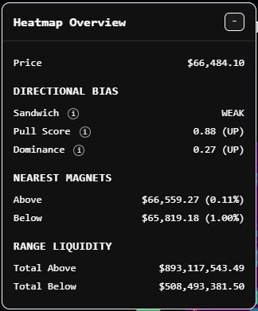

This panel answers one question: "**If price moves next, which direction is more likely first**?" Not, "where will price end the day?" And not, "where should my TP definitely go?" It's a **directional context panel**.

- **Pull Score**: What's pulling the price **right now**.
- **Dominance**: Where the bigger liquidity field sits **overall**.
- **Nearest Magnets**: What price is likely to test **first**.
- **Sandwich**: Whether price is trapped between two meaningful pulls.

### Price

The anchor. Everything else is relative to this. It is mainly used to understand how far the nearest magnets are and how close price is to getting swept one way or the other.

### Sandwich

**Possible values**: `WEAK`, `MODERATE`, `STRONG`. It can also be `NONE`, in which case the field will be hidden.

If the value is not `NONE`, it means there is **meaningful liquidity on both sides** of the price, so price is in a two-sided environment. The strength tells you how balanced those nearest two walls are.

- `STRONG`: Very balanced walls on both sides. It usually means there's a **high chance** of **sweep** behaviour and a **low chance** of a clean **one-way move**.
- `MODERATE`: **Both sides matter** but one side is still **meaningfully stronger**.
- `WEAK`: There is liquidity on both sides, but **one side is noticeably smaller**.

Sandwich is a **warning modifier**, not a primary signal. It tells you **how messy the path may be**, not which side definitely wins, so if Sandwich is strong, be more cautious. If it's weak, note it and move on.

### Pull Score

The most important line for **short-term direction**. It measures which side has more pull **after accounting for distance**. It's not just how much liquidity is above or below, it's **how much liquidity exists relative to how close it is**.

**Range**: -1 to +1.

**Interpretation bands**:

- **0.00 to 0.15**: Neutral
- **0.15 to 0.35**: Mild lean
- **0.35 to 0.60**: Strong lean
- **0.60 to 1.00**: Very strong lean

"0.78 (UP)", for instance, means "very strong upward pull" and **a strong Pull score should heavily influence one's directional bias**. It is the line that best answers, "what is price **most likely** to **test next**?"

**It is arguably the strongest metric on this panel to trade off.**

### Dominance

Compares total liquidity above vs below, ignoring distance, making it the **broader field bias**.

**Range**: -1 to +1.

**Interpretation bands**:

- **0.00 to 0.10**: Neutral
- **0.10 to 0.25**: Mild bias
- **0.25 to 0.45**: Moderate bias
- **0.45 to 1.00**: Strong bias

"0.29 UP", for instance, means "moderate upward overall liquidity field."

Dominance matters more for **where price may want to migrate over a larger move**, as opposed to Pull Score's next likely push. So if Pull Score and Dominance **agree** $\rightarrow$ **stronger conviction**, and if Pull Score and Dominance **disagree** $\rightarrow$ like **more complex path**.

### Nearest Magnets

These are the **closest non-zero liquidity rows** above and below the current price, represented as the **absolute price** value of the row (`$66,559.27`) and the **distance from price** as a percentage. (`0.11%`). It is useful because price often moves stepwise through liquidity.

If the **nearest magnet** agrees with Pull Score, it says "that side **is much more likely to be tested first**". Nearest magnets are mainly for **which side likely gets touched first** and not how far the mve goes after that.

**They are a first-destination clue**, not a full path forecast.

### Range Liquidity

These are the raw totals behind Dominance, and since Dominance already summarises them, they should mostly be used only to sanity-check the normalised value, as needed.

For actual decision-making Dominance is the preferred value, making these useful but secondary.
