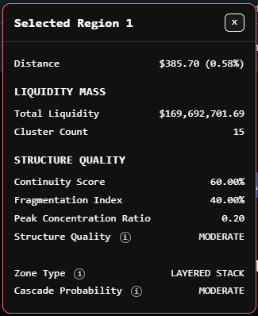

This panel answers one question: "**If I want to use this region as a target, is it a good target region?**" Not, "should I go long or short?" And not, "will price definitely reach it?" It is a **target quality panel**, meaning every value in it should be understood through that lens.

This panel is built from three decision layers:

1. **Reachability**: can price get there?
2. **Size / significance**: is there enough there to matter?
3. **Structural quality**: if it gets there, is it a clean region or a messy one?

### Distance

How far price currently is from the **nearest edge** of the selected region.

If the region is **above** price, it measures from current price to the **bottom** of the region. If the region is **below** price, it measures from current price to the **top** of the region. If price is **inside** the region, then `Distance = 0`.

It determines how far until price starts interacting with the region, not how far to the middle of the region.

`Distance` is the **reachability metric**. Smaller distance means price can reasonably reach this region soon, while larger distance means the target might be too ambitious for the current setup.

There is no universal "correct" distance because that depends on the overall trading system and volatility, but as a general rule:

- **Very low distance** (`0.00%` - `0.75%`) is very reachable and usually a strong candidate for a near target.
- **Moderate distance** (`0.75%` - `2.00%`) is in reasonable swing target territory.
- **High distance** (`2.00%` - `4.00%`) is possible, but only if price makes a meaningful move, so target quality has to be strong.
- **Very high distance** (`4.00%+`) becomes an ambitious destination, so be extra careful.

`Distance` answers, "is this region realistically reachable before something else happens?" so it should strongly affect TP choice.

Two regions can have similar liquidity but if one is nearer than the other, the nearer one is usually more practical.

### Total Liquidity

The total liquidation mass inside the selected region. So if a region contains `15` active rows, this is the sum of all their liquidity.

It shows how much total forced-order fuel exists in the region. More total liquidity means more reason for price to care about the region.

This is the **significance metric**, not a direction metric. A region with `$20M` is much less meaningful than a region with `$170M`, assuming everything else is comparable.

`Total Liquidity` alone is not enough because a region can have high total liquidity but still be a poor target if it is too far away, fragmented, dominated by one isolated spike, or poorly structured.

So big liquidity should never be an automatic TP. Instead, **big liquidity = worthy of consideration**.

`Total Liquidity` answers, "if price reaches this region, is there enough mass there for it to matter?" making it a core TP-selection variable.

If a region's total liquidity is small, one usually does not want to base a trade around it.

### Cluster Count

This is the number of rows in the region that contain liquidity, not the total selected rows.

It shows how many separate active liquidity nodes exist inside the region. Higher `Cluster Count` generally means more distributed participation inside the zone, while lower `Cluster Count` means the zone may be more concentrated or sparse.

It is not a standalone quality metric and only matters in combination with `Total Liquidity`, `Continuity Score`, and `Peak Concentration Ratio`.

For example:

- `15` clusters with high total liquidity is usually a meaningful region.
- `15` clusters with low total liquidity may be diffuse and weak.
- `3` clusters with high total liquidity could still be powerful, but may be spike-dominated.

`Cluster Count` helps in understanding if the region is broadly built or thinly built. It is not traded off directly, but helps contextualise the rest of the structure metrics.

### Continuity Score

This is calculated as the amount of active rows divided by the total selected rows, and it measures how "filled in" the region is.

For example, if `15` out of `25` selected rows have liquidity, then its continuity is `60%`.

`Continuity Score` shows how connected the region is. A higher score means price is more likely to move through the region smoothly, while a lower score means the region is patchy and broken up.

- **`75.00%` - `100.00%` (`High`)**: a very clean region with good target quality
- **`50.00%` - `75.00%` (`Moderate`)**: a decent region; not perfect, but usable
- **`0.00%` - `50.00%` (`Low`)**: a patchy region in which more caution is needed

`Continuity Score` matters because it affects how price behaves once it reaches the zone. High continuity supports smooth movement through the region, while low continuity supports jerky interaction, hesitation, and partial reactions.

So, in general, higher continuity makes a better TP region.

### Fragmentation Index

This is the opposite-side view of continuity. It measures how broken up the region is.

Low fragmentation means the region is cleaner and more connected. High fragmentation means the region has more gaps and behaves in a more patchy way.

- **`0.00%` - `20.00%`**: clean
- **`21.00%` - `40.00%`**: moderate
- **`40.00%+`**: fragmented

`Fragmentation Index` matters because gaps inside a region often reduce how smoothly price interacts with it. So lower fragmentation generally supports better target quality.

### Peak Concentration Ratio

**Range**: `0.00` - `1.00`

It measures how much of the region's total liquidity sits in its single largest cluster and is calculated as:

`largest cluster liquidity / total region liquidity`

A low ratio means liquidity is spread across the zone and a high ratio means one row dominates the region.

It is a **distribution shape metric**. Low concentration means the region behaves more like a real zone, while high concentration means the region might actually just be one standout spike instead of an actual region.

A low value is better for target regions because it means the zone has width and consistency.

- **`0.00` - `0.20` (`Low`)**: Healthy distribution
- **`0.20` - `0.40` (`Moderate`)**: Acceptable concentration
- **`0.40` - `1.00` (`High`)**: One-node dominance; proceed with caution

### Structure Quality

The panel's condensed verdict on the region's structure. It combines `Continuity Score`, `Fragmentation Index`, and `Peak Concentration Ratio` into a single label.

It answers, "is this zone clean enough to trust?"

`Structure Quality` matters a lot in decision-making.

- `STRONG`: A good region that's clean, connected, not overly dominated by one cluster.
- `MODERATE`: A usable region with some imperfections.
- `WEAK`: A messy region and low-confidence TP area.

### Zone Type

This is not a good/bad score, but instead a **type**. It describes the shape of the region.

- `Continuous Stack`: Rows are densely and smoothly packed; best "true zone" structure.
- `Layered Stack`: Still structured, but not perfectly continuous. It contains several meaningful layers of liquidity, so it is often still very tradable.
- `Fragmented`: Broken up. Patchy. More hesitation recommended.
- `Single Magnet`: One dominant row carries the region. More spike-like than zone-like.

`Zone Type` helps anticipate how price might interact with the region:

- `Continuous Stack`: flow
- `Layered Stack`: stair-step interaction
- `Fragmented`: patchy interaction
- `Single Magnet`: sharp reaction at one node

It is a **behaviour clue**, not a strength score.

### Cascade Probability

This estimates how likely the region is to produce a flow-through or chain reaction once price starts interacting with it.

It depends mainly on structure, continuity, and internal density.

- `High`: Once price enters the region, it may move through it aggressively.
- `Moderate`: There is some chance of flow-through, but it is not guaranteed.
- `Low`: Price may tag the region and react without much continuation.

`Cascade Probability` helps with TP confidence. A high-probability region is a better TP area because it suggests that if price gets there, it may really move through it.

`Moderate` is still meaningful, but `Low` means the region may only act as a touch-point.

